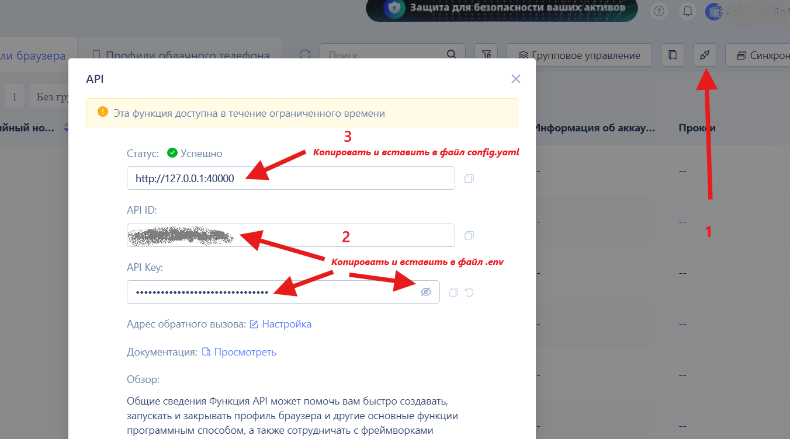
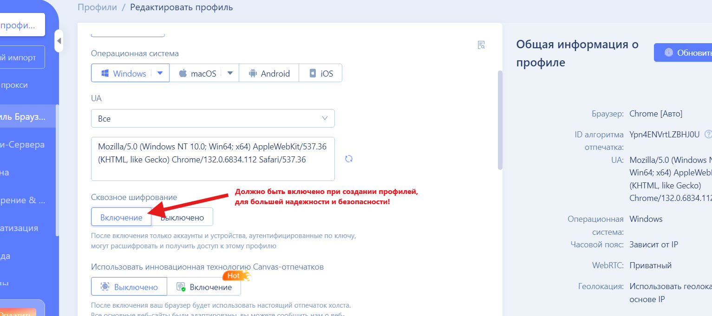
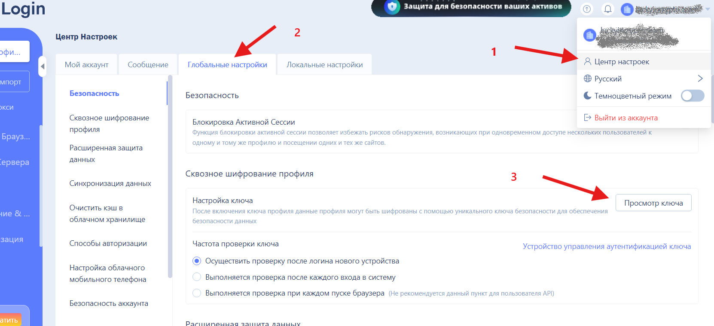
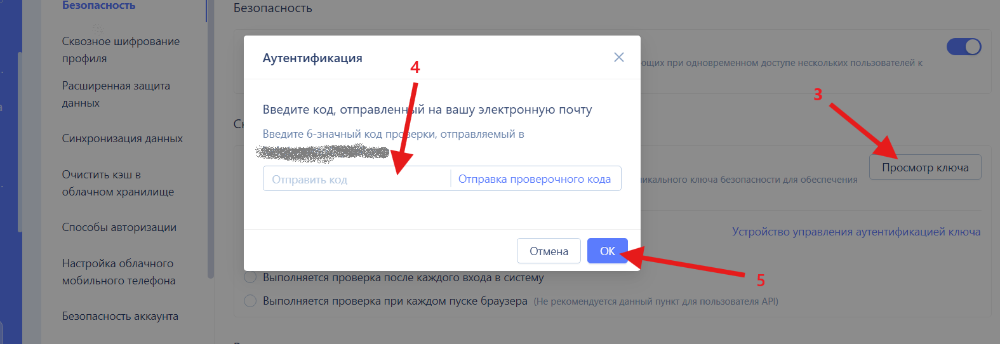
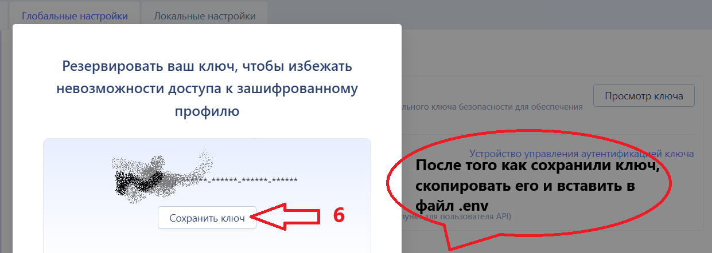
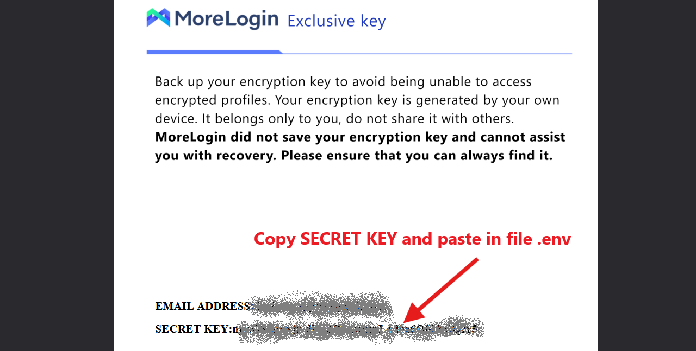
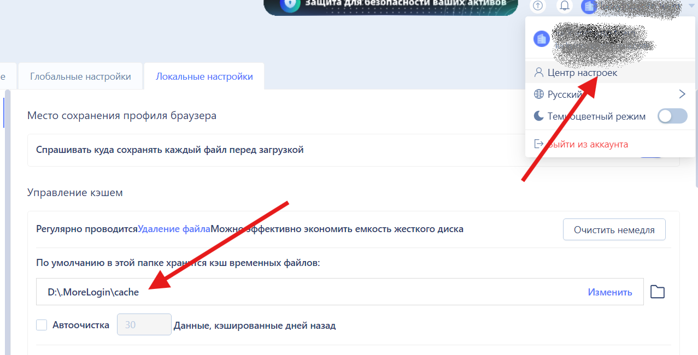
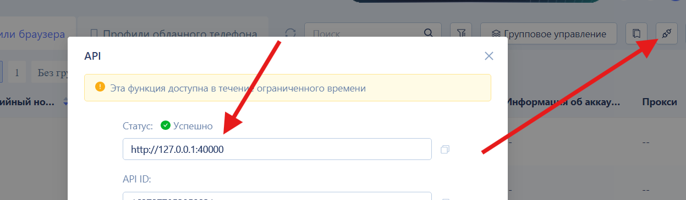
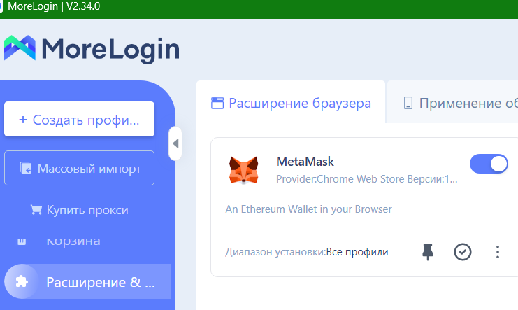
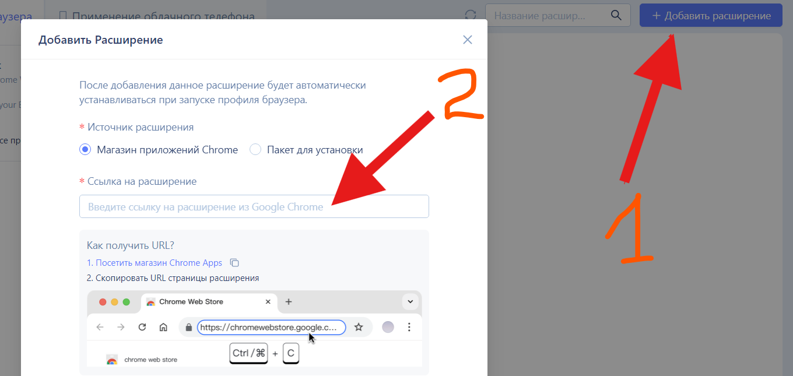

# Automation-MetaMask-MoreLogin

## Описание проекта
**Automation-MetaMask-MoreLogin** — это инструмент автоматизации, который интегрирует приложение MetaMask (extension) в браузерный профиль антидетект браузера MoreLogin.
Цель проекта — обеспечить удобную и безопасную работу с MetaMask крипто-кошельком в условиях динамической автоматизации.

### Основные функции:
- Инициализация браузерных профилей через API **MoreLogin**.
- Автоматизация взаимодействия с расширением MetaMask.
- Поддержка мультипрофильной работы для повышения анонимности и удобства.

---

## 📋 Содержание
1. [🚀 Установка проекта](#-установка-проекта)
2. [⚙️ Настройка проекта](#setup-project)
3. [📌 Использование](#-использование)
4. [📜 Требования](#-требования)
5. [📖 Источники информации](#-источники-информации)
6. [📬 Лицензия](#-лицензия)
7. [👤 Автор](#-автор)

--- 

## 🚀 Установка проекта
### 1️⃣ Клонирование репозитория:
- Перейдите в заранее подготовленную директорию для проекта.
- Откройте терминал (PowerShell, CMD, Git Bash или другой предпочитаемый инструмент командной строки).
- Выполните команду для клонирования репозитория:
    ```bash
    git clone https://github.com/luckyincrypto/Automation-MetaMask-MoreLogin.git
    ```

### 2️⃣ Создание виртуального окружения:
- Выполните команду для создания виртуального окружения:
    ```bash
    python -m venv venv
    ```
- Активируйте его:
    - Для Linux/Mac:
        ```bash
        source venv/bin/activate
        ```
    - Для Windows:
        ```bash
        venv\Scripts\activate
        ```

### 3️⃣ Установка библиотек зависимостей:
```bash
pip install -r requirements.txt
````

<p align="right"><a href="#-содержание" style="font-size:x-small;">⬆️ Вернуться к содержанию</a></p>

---

## ⚙️ Настройка проекта <a id="setup-project"></a>
### 1️⃣ Настройка файла для хранения переменных окружения .env:
- #### Создайте файл в каталоге проекта с названием .env и добавьте нужные переменные окружения:
- #### Пример файла .env находится в корне репозитория: .env-example

    ```bash
    APP_ID='your-api-key-goes-here'  # APP ID - Берем из MoreLogin 
    ```
  
    ```bash
    APP_KEY='your-secret-key-goes-here'  # APP Key - берем из MoreLogin 
    ```
  



- #### SECRET KEY используется когда сквозное шифрование включено. Настоятельно рекомендую включать эту опцию при создании профилей! 
 
   ```bash
   SECRET_KEY='your-encrypt-key-goes-here'  # берем из MoreLogin
   ```


    
 

 





- #### При первом запуске и отсутствия файла с Базой Данных в каталоге проекта сгенерируется новая, указанная в файле .env в атрибуте DATA_BASE со значением "any_words.xlsx"
    
    ```bash
    DATA_BASE='DB-example.xlsx'  # название вашей Базы Данных с паролями и сид фразами от MetaMask. 
    WORKSHEET_NAME='Sheet'  # название листа в Екселе.
    ```

### 2️⃣ Генерация базы данных. Все автоматические изменения производятся с учётом безопасности данных:

- Безопасность данных: Все изменения генерируются с учётом конфиденциальности.
- Удобство: Минимум ручной работы благодаря автоматической генерации.
- Гибкость: Возможность редактирования данных в любое время.

#### Если файл базы данных отсутствует или поля пустые:

  - База данных автоматически создаётся с новыми паролями, сид-фразами, адресами и приватными ключами.
  - Если сид-фраза указана, но поле адресов пустое, система автоматически заполнит адреса в соответствии с сид-фразой.
  - Если сид-фраза указана, но поле с паролями пустое, то автоматически создадутся новые пароли

#### Изменение паролей и сид-фраз:

 - Вы можете поменять пароли и сид-фразы в любое время, независимо от текущих настроек.
 - Если вы изменяете сид-фразу в базе данных на новую, рекомендуется также изменить пароли или оставить поле пароля пустым для автоматической генерации новых паролей.
Иначе будет вход в MetaMask по старому паролю, в случае успешного входа аккаунт MetaMask, address останется старым. Новая сид фраза не сработает.
 - При следующем запуске браузерного профиля будет выполнена повторная авторизация в MetaMask с обновлёнными данными (новыми паролями и/или сид-фразами).

### 3️⃣ Обязательные шаги настройки файла конфигурации config.yaml (форматируется в стиле YAML, Yet Another Markup Language), файл расположен в корневом каталоге проекта:
- #### Замените на свое значение path_local_cashe, взятое из **MoreLogin**. Убедитесь, что путь соответствует локальному расположению, это путь по умолчанию к папке, где хранится кэш профилей временных файлов. Берется из MoreLogin, Центр настоек -> Локальные настройки. 

     ```bash
     path_local_cashe: D:\.MoreLogin\cache 
     ```



- #### Замените на свое значение BASEURL, взятое из **MoreLogin**, Профиль Браузера -> API

     ```bash
     BASEURL: http://127.0.0.1:40000
     ```



#### После успешного изменения файлов .env и config.yaml ваши настройки полностью подготовлены для работы со скриптом, обеспечивая корректное взаимодействие всех программных модулей.

#### Следующий шаг: запуск скрипта и проверка работы.

<p align="right"><a href="#-содержание" style="font-size:x-small;">⬆️ Вернуться к содержанию</a></p>

---


## 📌 Использование

### 1️⃣ После настройки запускайте ключевой скрипт:

- #### Из терминала или консоли CLI

    ```bash
    python main.py 
    ```
- #### Из IDE ([Pycharm](https://www.jetbrains.com/pycharm/) или [VS Code](https://code.visualstudio.com/))
    или **run 'main'** (Shift+F10)

### 2️⃣ Логирование процессов в проекте
#### Во всех файлах проекта используется логирование, которое предоставляет детальную информацию о каждом этапе выполнения скриптов. Это помогает анализировать выполнение процессов и выявлять возможные ошибки.
#### По умолчанию в config.yaml установлено значение DEBUG, которое отображает максимально подробную информацию в консоли, включая служебные сообщения. Если пользователь хочет убрать излишнюю информацию, можно изменить уровень логирования на INFO или выше.
#### Поддерживаемые уровни логирования:
- DEBUG — отображает все служебные сообщения (наиболее подробный уровень).
- INFO — выводит только ключевые сообщения о процессе работы.
- WARNING — показывает предупреждения, игнорируя вспомогательную информацию.
- ERROR — отображает только ошибки, без лишних технических подробностей.
- CRITICAL — фиксирует только критические ошибки, требующие срочного вмешательства.
#### При этом, вне зависимости от уровня логирования в консоли, в файл логов (app.log в корне проекта) записываются сообщения уровня WARNING, ERROR и CRITICAL.

<p align="right"><a href="#-содержание" style="font-size:x-small;">⬆️ Вернуться к содержанию</a></p>

---

## 📜 Требования
- **Python** версии 3.8 или выше (используемая версия: 3.13)  
  Скачать: [Python 3.13](https://www.python.org/downloads/release/python-3130/)
- **IDE:** [Pycharm](https://www.jetbrains.com/pycharm/) или [VS Code](https://code.visualstudio.com/)
- **Антидетект браузер:** [MoreLogin](https://www.morelogin.com/?from=AANRkwFFphIV)  
  *Morelogin является самым безопасным, наиболее подходящим для работы в команде и предлагает наилучшую экономическую эффективность.*
- **Расширение MetaMask, установленное в MoreLogin:**  
  Установить в разделе "Расширение & Приложение"    
  Ссылка на MetaMask: [MetaMask в Chrome Store](https://chromewebstore.google.com/detail/metamask/nkbihfbeogaeaoehlefnkodbefgpgknn)  
  **Важно!** ID MetaMask: `nkbihfbeogaeaoehlefnkodbefgpgknn`

<p align="right"><a href="#-содержание" style="font-size:x-small;">⬆️ Вернуться к содержанию</a></p>

---

## 📖 Источники информации
- [Официальный сайт MoreLogin](https://www.morelogin.com/?from=AANRkwFFphIV)
- [Документация MoreLogin](https://support.morelogin.com/en/articles/10204806-browser-profile)
- [MoreLogin-API-Demos на GitHub](https://github.com/MoreLoginBrowser/MoreLogin-API-Demos) – использован модуль `base_func_morelogin.py`
- [Документация Selenium](https://www.selenium.dev/documentation/webdriver/)


<p align="right"><a href="#-содержание" style="font-size:x-small;">⬆️ Вернуться к содержанию</a></p>

---

## 📬 Лицензия
Этот проект распространяется под лицензией MIT. Подробнее см. [LICENSE](./LICENSE).

<p align="right"><a href="#-содержание" style="font-size:x-small;">⬆️ Вернуться к содержанию</a></p>

---

## 👤 Автор
Этот проект создан Luckyincrypto.  
GitHub: [Luckyincrypto](https://github.com/Luckyincrypto)

<p align="right"><a href="#-содержание" style="font-size:x-small;">⬆️ Вернуться к содержанию</a></p>

---
